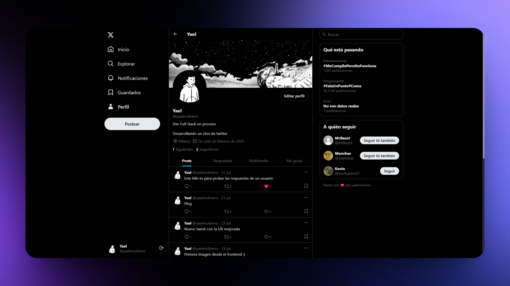

> [!IMPORTANT]
> 💻 Este es un proyecto personal creado con la finalidad de practicar conocimientos de frontend y backend

## 🛠️ Frontend Stack

- [React](https://react.dev)
- [Tanstack Query](https://tanstack.com)
- [React Router](https://reactrouter.com)
- [TailwindCSS](https://tailwindcss.com)
- [TypeScript](https://www.typescriptlang.org)

## 🛠️ Backend Stack

- [Express](https://expressjs.com)
- [PostgreSQL](https://node-postgres.com)
- [JWT](https://jwt.io)
- [Zod](https://zod.dev)
- [Cloudinary](https://cloudinary.com/image-api)
- [TypeScript](https://www.typescriptlang.org)
